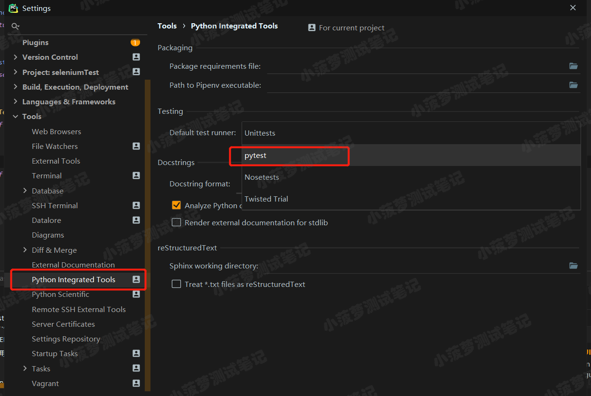
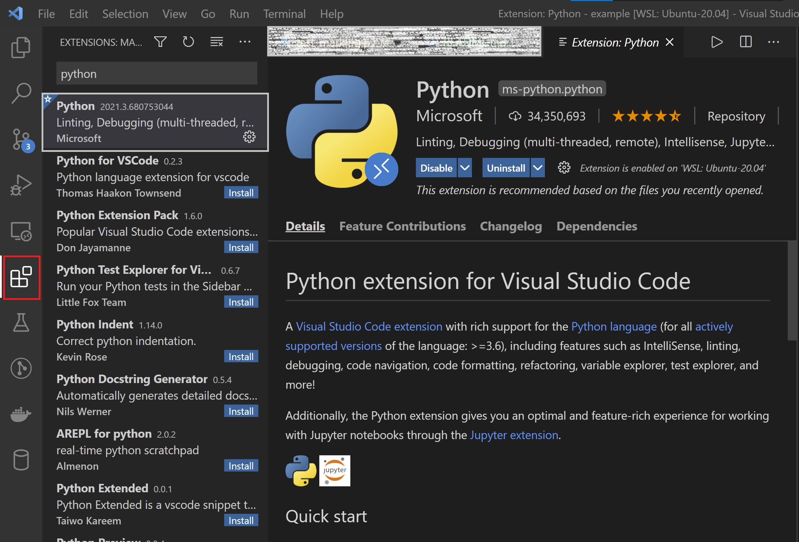

# pytest

## 1. 书写测试代码

以 `test_` 开头或者以 `_test` 结尾的 `.py` 文件会被识别为测试文件，例如：`test_database.py` 或者 `service_test.py`

在测试文件中，所有以 `test_` 开头的函数作为测试函数，例如：

```python
def test_run() -> None:
    ...
```

在测试文件中，所有以 `Test` 开头的类，以及类中以 `test_` 开头的方法，作为测试类的测试方法，例如：

```python
class TestApi:
    def test_run() -> None:
        ...
```

> 测试类中不能包含 `__init__` 方法

## 2. 命令行

- `$ pytest`: 执行当前路径和子路径下的所有测试
- `$ pytest --collect-only`: 收集所有测试，但并不实际执行
- `$ pytest foo.py bar.py`: 执行指定文件中的测试
- `$ pytest -q`: 测试完毕后，输出简要测试结果报告
- `$ pytest <scope>`: 执行指定的测试，例如：

    ```bash
    $ pytest foo.py::test_something
    $ pytest foo.py::TestService::test_get_user
    ```

- `$ pytest -v`: 测试完毕后，输出详细测试结果报告
- `$ pytest -s`, `$pytest --capture=no`: 如果在测试中使用了 print，则允许输出内容
- `$ pytest -x`, `$ pytest --exitfirst`: 如果遇到测试失败，则停止整个测试
- `$ pytest --maxfail=<n>`: 在测试失败 n 次后，停止整个测试
- `$ pytest -k`: 对要执行的测试进行过滤，包括：
  - 包含名称匹配的测试，例如：

    ```bash
    $ pytest -s -k "http"  # 执行名为 http 的测试
    $ pytest -s -k "http or websockt"  # 执行名为 http 或 websocket 的测试
    ```

  - 排除名称匹配的测试，例如：

    ```bash
    $ pytest -s -k "not http"  # 跳过名为 http 的测试
    ```

- `$ pytest -l`, `$ pytest --showlocals`: 显示所执行测试中使用的本地变量
- `$ pytest -m <mark>`: 执行具备指定标记的测试，标记可通过 `@pytest.mark.<mark>` 装饰器设置
- `$pytest --junit-xml=<path>`: 输出 XML 格式的测试报告，例如：

    ```bash
    $ pytest --junit-xml=./reports/test-report.xml
    ```

### 3. 在 IDE 中使用

#### 3.1. PyCharm

打开 PyCharm 设置，在 `Tools`/`Python Integrated Tools` 选项中，选择 "Default test runner" 并选中 "pytest"



#### 3.2. Virtual Studio Code

安装官方扩展 "Python"



通过快捷键 `Ctl` + `Shift` + `p`，选择 "Python: Configure Tests" 并选中 "pytest"，设置测试文件所在的路径即可

## 4. 插件

### 4.1. pytest-rerunfailures 插件

如果测试执行失败，可以对其进行重试

```bash
$ pip install pytest-rerunfailures
```

设置重试次数

```bash
$ pytest --reruns=3  # 对执行失败的测试，最多重试 3 次
```

设置每次重试之间的时间间隔

```bash
$ pytest --reruns=3 --reruns-delay=10  # 两次重试之间间隔 10 秒
```

注意：

- 不要和 `@fixture` 装饰器一同使用
- 和 `pytest-xdist` 插件的 `--looponfail` 参数不兼容
- 和 `--pdb` 参数不兼容

### 4.2. pytest-html 插件

输出 HTML 格式的测试报告

```bash
$ pip install pytest-html
```

输出 HTML 格式的测试报告

```bash
$ pytest --html=./reports/test-reports.html
```

输出内嵌 CSS 的 HTML 测试报告

```bash
$ pytest --html=./reports/test-reports.html --self-contained-html
```

### 4.3. pytest-repeat 插件

重复执行测试

```bash
$ pip install pytest-repeat
```

设置重复执行次数

```bash
$ pytest --count=10  # 重复执行指定测试 10 次
```

重复执行测试直到其执行失败

```bash
$ pytest --count=1000 -x  # 最多执行 1000 次，或执行失败
```

设置重复执行的范围

```bash
$ pytest --count=2 --repeat-scope=class
```

- `--repeat-scope` 参数值可以为：`function`, `class`, `module` 或者 `session`

### 4.4. pytest-cov 参数

计算代码的测试覆盖率

```bash
$ pip install pytest-cov
```

执行测试并计算测试覆盖率

```bash
$ pytest --cov=./backend/app tests  # 执行 test 目录下的测试并依据 ./backend/app 目录下的源文件计算测试覆盖率
```

以 HTML 格式输出测试覆盖率报告

```bash
$ pytest --cov=./backend/app --cov-report=html tests
```

### 4.5. pytest-assume 插件

允许使用多重断言

```bash
$ pip install pytest-assume
```

多重断言允许将一个测试中所有的断言全部执行完毕，统一输出结果，参考 `test_assertion.py` 文件中的 `test_assume_assertion1` 和 `test_assume_assertion2` 两个测试函数

## 5. pytest.ini 配置文件

`pytest.ini` 配置文件需要放置在项目的根路径，通过执行 `pytest --help` 可以列出所有的配置项：

- `marks`
- `xfail_strict`

    ```ini
    [pytest]
    xfail_strict = True
    ```

    如果设置 `xfail_strict = True`，所有标记为 `xfail` 的测试会失败

- `addopts`：设置 `pytest` 命令的默认参数

    ```ini
    [pytest]
    addopts = -v --reruns=1 --count=2 --html=./reports/html-reports.html -n=auto
    ```

- `log_cli`: 设置是否在控制台实时输出 log

    ```ini
    [pytest]
    log_cli = 0
    ```

- `norecursedirs`：设定一些无需遍历的目录以加快测试执行效率

  ```ini
  [pytest]
  norecursedirs = .* build dist CVS _darcs {arch} *.egg venv src resources log report util
  ```

- 设置测试文件、测试类和测试函数名称

  默认的测试文件、测试类和测试函数命名如下：

  - 文件名以 `test_*` 开头或以 `*_test.py` 结尾
  - 函数名以 `test_` 开头
  - 类名以 `Test` 开头且不能包含 `__init__` 方法
  - 测试类中以 `test_` 开头的方法

  通过如下配置可以修改如上述的规则：

    ```ini
    [pytest]
    python_files = test_* *_test
    python_classes = Test* test*
    python_functions = test_* test*
    ```
