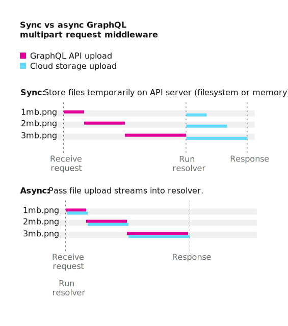

# 通过 GraphQL 上传文件

文件上传不是官方定义的功能, 也不是 Graphene 框架原生提供的实现.

如果需要使用文件上传功能, 可以通过如下扩展库: [graphene-file-upload](https://github.com/lmcgartland/graphene-file-upload), 该库为 Graphene 框架增加了文件上传功能并符合非官方 GraphQL 定义 [multipart request spec](https://github.com/jaydenseric/graphql-multipart-request-spec).

## 1. GraphQL 的多部分表单规格定义

一个 GraphQL 请求的多部分表单字段结构, 使用了多种 客户端/服务端 文件上传实现

可能的实现包括:

- 内嵌文件 (一般作为变量).
- 批量操作.
- 文件去重.
- 解析文件上传流.
- 取消文件上传流.



### 1.1. 内嵌文件

An "operations object" is an [Apollo GraphQL POST request](https://www.apollographql.com/docs/apollo-server/requests/#postRequests) (or array of requests if batching). An "operations path" is an [`object-path`](https://www.npmjs.com/package/object-path) string to locate a file within an operations object.

So operations can be resolved while the files are still uploading, the fields are ordered:

1. `operations`: A JSON encoded operations object with files replaced with `null`.
2. `map`: A JSON encoded map of where files occurred in the operations. For each file, the key is the file multipart form field name and the value is an array of operations paths.
3. File fields: Each file extracted from the operations object with a unique, arbitrary field name.

## 2. 范例

### 2.1. 单文件

#### Operations

```javascript
{
    query: `
        mutation($file: Upload!) {
            singleUpload(file: $file) {
                id
            }
        }
    `,
    variables: {
        file: File  // a.txt
    }
}
```

#### cURL request

```bash
$ curl localhost:3001/graphql \
  -F operations='{ "query": "mutation ($file: Upload!) { singleUpload(file: $file) { id } }", "variables": { "file": null } }' \
  -F map='{ "0": ["variables.file"] }' \
  -F 0=@a.txt
```

#### Request payload

```plain
--------------------------cec8e8123c05ba25
Content-Disposition: form-data; name="operations"

{ "query": "mutation ($file: Upload!) { singleUpload(file: $file) { id } }", "variables": { "file": null } }
--------------------------cec8e8123c05ba25
Content-Disposition: form-data; name="map"

{ "0": ["variables.file"] }
--------------------------cec8e8123c05ba25
Content-Disposition: form-data; name="0"; filename="a.txt"
Content-Type: text/plain

Alpha file content.

--------------------------cec8e8123c05ba25--
```

### 2.2. 多文件

#### Operations

```javascript
{
    query: `
        mutation($files: [Upload!]!) {
            multipleUpload(files: $files) {
                id
            }
        }
    `,
    variables: {
        file: [
            File,   // a.txt
            File    // a.txt
        ]
    }
}
```

#### cURL request

```bash
$ curl localhost:3001/graphql \
  -F operations='{ "query": "mutation ($files: [Upload!]!) { multipleUpload(files: $files) { id } }", "variables": { "files": [null, null] } }' \
  -F map='{ "0": ["variables.file.0"], "1": ["variables.files.1"] }' \
  -F 0=@a.txt \
  -F 1=@b.txt
```

#### Request payload

```plain
--------------------------ec62457de6331cad
Content-Disposition: form-data; name="operations"

{ "query": "mutation($files: [Upload!]!) { multipleUpload(files: $files) { id } }", "variables": { "files": [null, null] } }
--------------------------ec62457de6331cad
Content-Disposition: form-data; name="map"

{ "0": ["variables.files.0"], "1": ["variables.files.1"] }
--------------------------ec62457de6331cad
Content-Disposition: form-data; name="0"; filename="b.txt"
Content-Type: text/plain

Bravo file content.

--------------------------ec62457de6331cad
Content-Disposition: form-data; name="1"; filename="c.txt"
Content-Type: text/plain

Charlie file content.

--------------------------ec62457de6331cad--
```

### 2.3. 批处理

#### Operations

```javascript
[
    {
        query: `
            mutation($file: Upload!) {
                singleUpload(file: $file) {
                    id
                }
            }
        `,
        variables: {
            file: File // a.txt
        }
    },
    {
        query: `
            mutation($files: [Upload!]!) {
                multipleUpload(files: $files) {
                    id
                }
            }
        `,
        variables: {
            files: [
                File, // b.txt
                File  // c.txt
            ]
        }
    }
]
```

#### cURL request

```bash
$ curl localhost:3001/graphql \
  -F operations='[{ "query": "mutation ($file: Upload!) { singleUpload(file: $file) { id } }", "variables": { "file": null } }, { "query": "mutation($files: [Upload!]!) { multipleUpload(files: $files) { id } }", "variables": { "files": [null, null] } }]' \
  -F map='{ "0": ["0.variables.file"], "1": ["1.variables.files.0"], "2": ["1.variables.files.1"] }' \
  -F 0=@a.txt \
  -F 1=@b.txt \
  -F 2=@c.txt
```

#### Request payload

```plain
--------------------------627436eaefdbc285
Content-Disposition: form-data; name="operations"

[{ "query": "mutation ($file: Upload!) { singleUpload(file: $file) { id } }", "variables": { "file": null } }, { "query": "mutation($files: [Upload!]!) { multipleUpload(files: $files) { id } }", "variables": { "files": [null, null] } }]
--------------------------627436eaefdbc285
Content-Disposition: form-data; name="map"

{ "0": ["0.variables.file"], "1": ["1.variables.files.0"], "2": ["1.variables.files.1"] }
--------------------------627436eaefdbc285
Content-Disposition: form-data; name="0"; filename="a.txt"
Content-Type: text/plain

Alpha file content.

--------------------------627436eaefdbc285
Content-Disposition: form-data; name="1"; filename="b.txt"
Content-Type: text/plain

Bravo file content.

--------------------------627436eaefdbc285
Content-Disposition: form-data; name="2"; filename="c.txt"
Content-Type: text/plain

Charlie file content.

--------------------------627436eaefdbc285--
```
