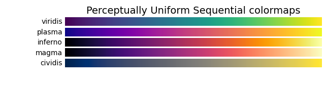

# 绘图参数

## 颜色

### RGB 颜色

| 选项                 |  说明  | 对应的 RGB 三元数 |
| :------------------- | :----: | ----------------: |
| `"red"` 或 `"r"`     |  红色  |       `(1, 0, 0)` |
| `"green"` 或 `"g"`   |  绿色  |       `(0, 1, 0)` |
| `"blue"` 或 `"b"`    |  蓝色  |       `(0, 0, 1)` |
| `"yellow"` 或 `"y"`  |  黄色  |       `(1, 1, 0)` |
| `"magenta"` 或 `"m"` | 品红色 |       `(1, 0, 1)` |
| `"cyan"` 或 `"c"`    | 青蓝色 |       `(0, 1, 1)` |
| `"white"` 或 `"w"`   |  白色  |       `(1, 1, 1)` |
| `"black"` 或 `"k"`   |  黑色  |       `(0, 0, 0)` |
| `"#rrggbb"`          | RGB 色 |    `(rr, gg, bb)` |

### 调色板

| 调色板名称       |         保留关键字 |
| :--------------- | -----------------: |
| Accent           |           Accent_r |
| Blues            |            Blues_r |
| BrBG             |             BrBG_r |
| BuGn             |             BuGn_r |
| BuPu             |             BuPu_r |
| CMRmap           |           CMRmap_r |
| Dark2            |            Dark2_r |
| GnBu             |             GnBu_r |
| Greens           |           Greens_r |
| Greys            |            Greys_r |
| OrRd             |             OrRd_r |
| Oranges          |          Oranges_r |
| PRGn             |             PRGn_r |
| Paired           |           Paired_r |
| Pastel1          |          Pastel1_r |
| Pastel2          |          Pastel2_r |
| PiYG             |             PiYG_r |
| PuBu             |             PuBu_r |
| PuBuGn           |           PuBuGn_r |
| PuOr             |             PuOr_r |
| PuRd             |             PuRd_r |
| Purples          |          Purples_r |
| RdBu             |             RdBu_r |
| RdGy             |             RdGy_r |
| RdPu             |             RdPu_r |
| RdYlBu           |           RdYlBu_r |
| RdYlGn           |           RdYlGn_r |
| Reds             |             Reds_r |
| Set1             |             Set1_r |
| Set2             |             Set2_r |
| Set3             |             Set3_r |
| Spectral         |         Spectral_r |
| Wistia           |           Wistia_r |
| YlGn             |             YlGn_r |
| YlGnBu           |           YlGnBu_r |
| YlOrBr           |           YlOrBr_r |
| YlOrRd           |           YlOrRd_r |
| afmhot           |           afmhot_r |
| autumn           |           autumn_r |
| binary           |           binary_r |
| bone             |             bone_r |
| brg              |              brg_r |
| bwr              |              bwr_r |
| cividis          |          cividis_r |
| cool             |             cool_r |
| coolwarm         |         coolwarm_r |
| copper           |           copper_r |
| cubehelix        |        cubehelix_r |
| flag             |             flag_r |
| gist_earth       |       gist_earth_r |
| gist_gray        |        gist_gray_r |
| gist_heat        |        gist_heat_r |
| gist_ncar        |        gist_ncar_r |
| gist_rainbow     |     gist_rainbow_r |
| gist_stern       |       gist_stern_r |
| gist_yarg        |        gist_yarg_r |
| gnuplot          |          gnuplot_r |
| gnuplot2         |         gnuplot2_r |
| gray             |             gray_r |
| hot              |              hot_r |
| hsv              |              hsv_r |
| inferno          |          inferno_r |
| jet              |              jet_r |
| magma            |            magma_r |
| nipy_spectral    |    nipy_spectral_r |
| ocean            |            ocean_r |
| pink             |             pink_r |
| plasma           |           plasma_r |
| prism            |            prism_r |
| rainbow          |          rainbow_r |
| seismic          |          seismic_r |
| spring           |           spring_r |
| summer           |           summer_r |
| tab10            |            tab10_r |
| tab20            |            tab20_r |
| tab20b           |           tab20b_r |
| tab20c           |           tab20c_r |
| terrain          |          terrain_r |
| twilight         |         twilight_r |
| twilight_shifted | twilight_shifted_r |
| viridis          |          viridis_r |
| winter           |           winter_r |

## 标记样式

|                     值 | 说明   |
| ---------------------: | :----- |
|                  `"o"` | 圆圈   |
|                  `"+"` | 加号   |
|                  `"*"` | 星号   |
|                  `"."` | 点     |
|                  `"x"` | 叉号   |
|    `"square"` 或 `"s"` | 方形   |
|   `"diamond"` 或 `"d"` | 菱形   |
|                  `"^"` | 上三角 |
|                  `"v"` | 下三角 |
|                  `">"` | 右三角 |
|                  `"<"` | 左三角 |
| `"pentagram"` 或 `"p"` | 五角星 |
|  `"hexagram"` 或 `"h"` | 六角星 |
|               `"none"` | 无标记 |
